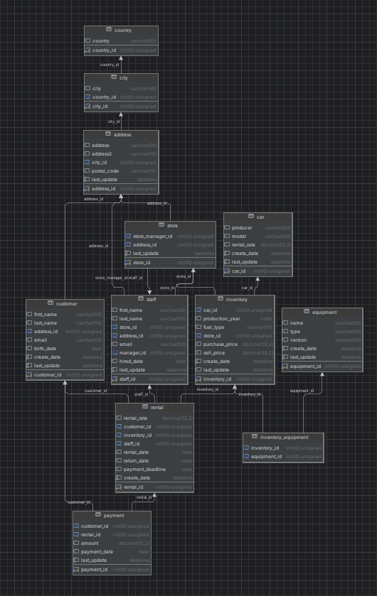

Zadanie:

Zbuduj skrypt generujący dane o wypożyczeniach w fikcyjnej wypożyczalni samochodów "wheelie".

Wypożyczenie to wiersz w tabeli rental z wypełnionymi wszystkimi polami.

Wypożyczony może być tylko samochód, który znajduje się w dniu wypożyczenia na stanie (nie jest wypożyczony komuś innemu, lub sprzedany, ale jest już zakupiony). Może być wypożyczony jedynie istniejącemu w danym dniu klientowi.

Wypożyczenia powinny zwiększać się w weekend oraz w miesiącach lipiec i sierpień o 10-20%.

najlepiej jeśli target wypożyczeń, jak również miesiące zwiększonej aktywności i wielkość zwiększenia tej aktywności będą konfigurowalne bez ingerencji w kod. Skrypt powinien przyjmować jeden argument przy uruchomieniu - ilość dni, dla których mają zostać wytworzone dane, i tworzyć dane zaczynając od ostatniego dnia wypożyczeń zapisanego w tabeli rental (właściwie od dnia następnego).

https://mariadb.com/resources/blog/how-to-connect-python-programs-to-mariadb/

